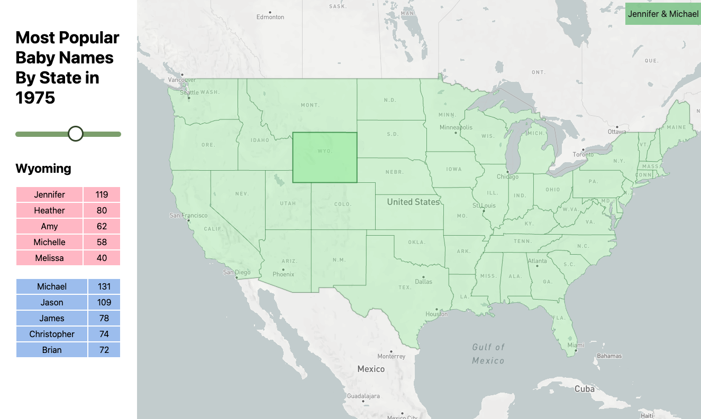

# Popular Baby Names in The United States Map

Using D3.js and Mapbox to make an interface for exploring popular baby names from state to state, year over year.

Using state geojson from (PublicaMundi)[https://github.com/PublicaMundi/MappingAPI/blob/master/data/geojson/us-states.json?short_path=1c1ebe5] and baby name data from (The Social Security Administration)[https://www.ssa.gov/oact/babynames/limits.html].

